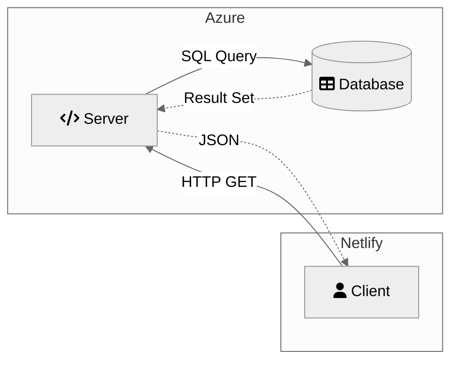

```mermaid
---
config:
  layout: dagre
  look: classic
  theme: neutral
---
flowchart LR
    subgraph Azure
        s[fa:fa-code Server]
        db[(fa:fa-table Database)]
    end
    subgraph Netlify
        c[fa:fa-user Client]
    end

    subgraph Netlify
    end
    subgraph Azure
        direction LR
    end
    
    c -- HTTP GET --> s
    s -- SQL Query --> db
    db -. Result Set .-> s
    s -. JSON .-> c
```