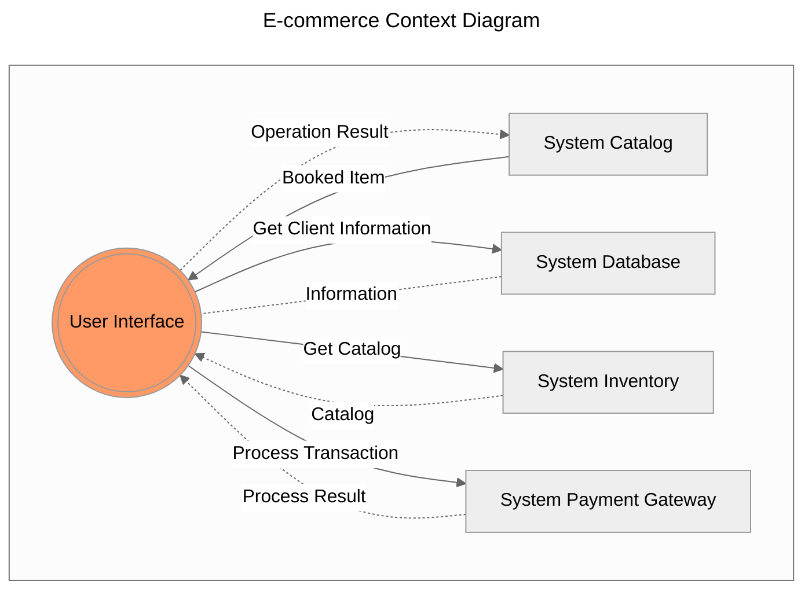

```mermaid
---
title: E-commerce Context Diagram
config:
  layout: dagre
  look: classic
  theme: neutral
---
    flowchart TD
        %% define components
        UserInterface(((User Interface)))
        PaymentGateway[System Payment Gateway]
        Inventory[System Inventory]
        Database[System Database]
        Catalog[System Catalog]

        subgraph " "
            direction LR
            %% define relationships
            Catalog -- Booked Item --> UserInterface
            UserInterface -.Operation Result.-> Catalog
            UserInterface:::someclass --Get Client Information--> Database
            classDef someclass fill:#f96
            Database -.Information.- UserInterface
            UserInterface -- Get Catalog--> Inventory
            Inventory -. Catalog .-> UserInterface
            UserInterface --Process Transaction--> PaymentGateway
            PaymentGateway -.Process Result.->UserInterface
        end
```