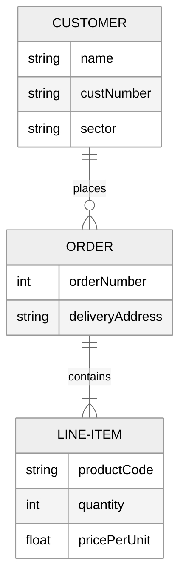

```mermaid
---
config:
  layout: dagre
  look: classic
  theme: neutral
---
    erDiagram
        
        %% specify entities
        CUSTOMER {
            string name
            string custNumber
            string sector
        }
        
        ORDER {
            int orderNumber
            string deliveryAddress
        }

        LINE-ITEM {
            string productCode
            int quantity
            float pricePerUnit
        }


    %% specify relationships
    CUSTOMER ||--o{ ORDER : places
    ORDER ||--|{ LINE-ITEM : contains
```