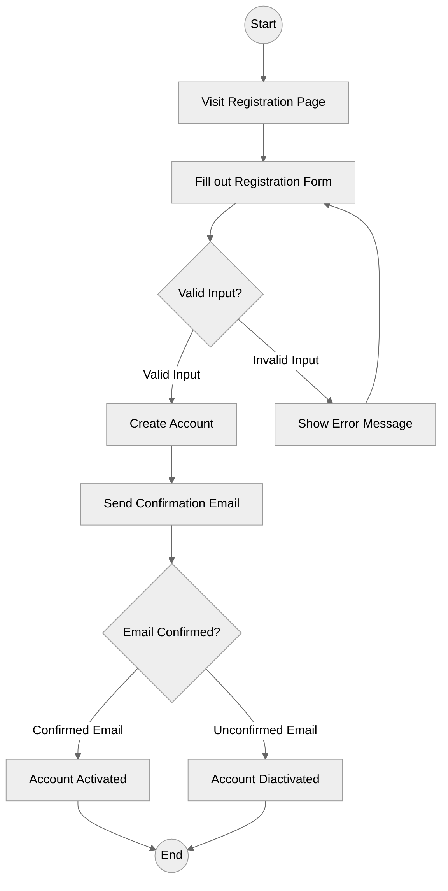

```mermaid
---
config:
  layout: dagre
  look: classic
  theme: neutral
---
flowchart TB
  A((Start))
  A --> B[Visit Registration Page]
  B --> C[Fill out Registration Form]
  C --> D{Valid Input?}
  D -- Valid Input --> E[Create Account]
  E --> F[Send Confirmation Email]
  F --> W{Email Confirmed?}
  W --Confirmed Email--> H[Account Activated]
  W --Unconfirmed Email--> DA[Account Diactivated]
  H --> EN((End))
  DA --> EN
  D -- Invalid Input --> I[Show Error Message]
  I --> C
```