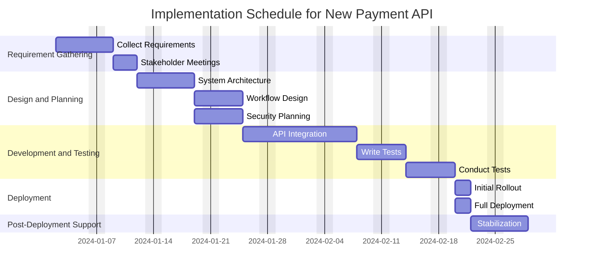

```mermaid
gantt
    title Implementation Schedule for New Payment API
    dateFormat  YYYY-MM-DD
    excludes weekends

    section Requirement Gathering
    Collect Requirements  :req1, 2024-01-02, 5d
    Stakeholder Meetings  :sm1, after req1  , 3d

    section Design and Planning
    System Architecture   :sa1, after sm1, 5d
    Workflow Design       :wd1, after sa1, 4d
    Security Planning     :sp1, after sa1, 4d

    section Development and Testing
    API Integration       :ai1, after wd1, 10d
    Write Tests           :wt1, after ai1, 4d
    Conduct Tests         :ct1, after wt1, 4d

    section Deployment
    Initial Rollout       :ir1, after ct1, 2d
    Full Deployment       :fd1, after ct1, 2d

    section Post-Deployment Support
    Stabilization          :bf1, after fd1, 5d
```
